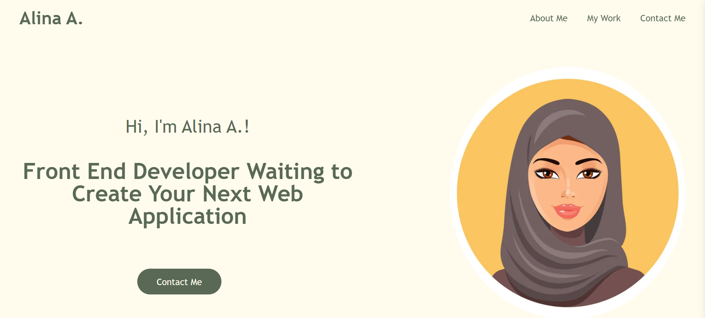

# my_portfolio
# Description 
This is my personal portfolio which has been created using HTML and CSS. It includes the following sections: About Me, My Work and Contact Me.
[Link to the deployed project](https://al946x.github.io/my_portfolio/)

# Screenshot 

# Installation
Clone the repo from github and run it on your local machine

# Usage
N/A

# Credits
N/A

# License
N/A
